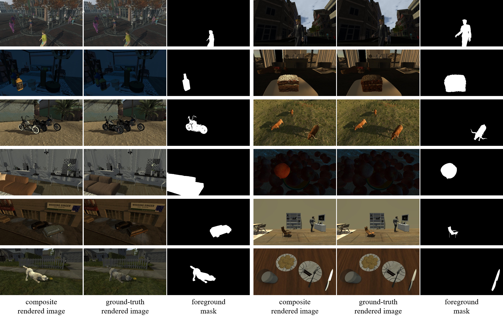
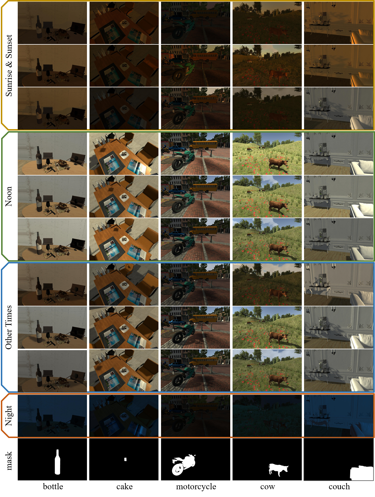
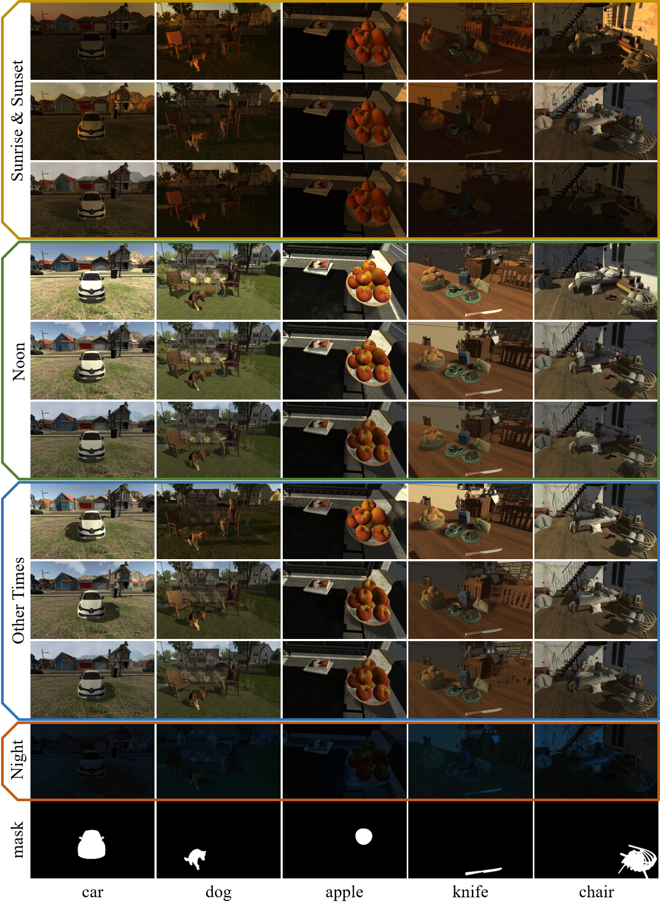

# Rendered_Image_Harmonization_Dataset

This is the official repository for the following paper:

> **Deep Image Harmonization by Bridging the Reality Gap**  [[arXiv]](https://arxiv.org/pdf/2103.17104.pdf)<br>
>
> Junyan Cao, Wenyan Cong, Li Niu, Jianfu Zhang, Liqing Zhang <br>
> Accepted by **BMVC 2022**.


**RdHarmony** is a large-scale Rendered Image Harmonization dataset containing pairs of ground-truth rendered images and composite rendered images with 11 novel categories, which is useful for supervised image harmonization methods. **Note that in our paper, RdHarmony contains rendered training pairs with 6 novel categories. We extend it to 5 more novel categories now.**



## Highlights

- 11 categories, containing "human", "bottle", "cake", "motorcycle", "cow", "couch", "apple", "car",  "chair", "dog" and "knife"
- 15000 ground-truth rendered images for "human" category and 1000 ground-truth rendered images for each other, with image resolution of 1920*1080
- maximally 225000 pairs of ground-truth rendered images and composite rendered images
- accurate foreground masks
- automatic rendered image generation and composite image generation
- 30 indoor/outdoor 3D scenes
- 50 viewpoints(2D scene) for each 3D scene
- 10 representative capture conditions for each 2D scene


## Downloads

For "human" novel category:

- 15000 ground-truth rendered images [[Baidu_Cloud\]](https://pan.baidu.com/s/1zOzLZe5BREXN26sn9NMmxg) (access code: m4de)
- 65000 rendered image pairs used in our paper [[Baidu_Cloud\]](https://pan.baidu.com/s/1eS_XE_bTDRvdGCUg9o42RQ) (access code: vnnj)

For other 10 novel categories ("bottle", "cake", "motorcycle", "cow", "couch", "apple", "car",  "chair", "dog" and "knife"):

- 10000 ground-truth rendered images [[Baidu_Cloud\]](https://pan.baidu.com/s/1ZPHIVXGS7z4Xv5TuVyzumw) (access code: z7mb)
- 90000 rendered image pairs [[Baidu_Cloud\]](https://pan.baidu.com/s/13tsKitKzblp40BLYsKMhwg) (access code: u65p)


## Details

- ### **Ground-truth Rendered Image Generation**

  We collect 30 3D scenes from Unity Asset Store and CG websites, including outdoor scenes (e.g., raceway, downtown, street, forest) and indoor scenes (e.g., bar, stadium, gym). For each 2D scene shot in 3D scenes, we sample 10 ground-truth rendered images with 10 different capture conditions (i.e., styles), including the the night style as well as styles of Clear/PartlyCloudy/Cloudy weather at sunrise&sunset/noon/other-times. Example scenes of 11 novel categories with all 10 ground-truth rendered images are shown below. Under each time of the day except “Night”, from top to bottom, we show rendered images captured under Clear, Partly Cloudy, and Cloudy weather.






- ### **Composite Rendered Image Generation**

  For each 2D scene, there are 10 ground-truth rendered images with 10 different styles, where one 3D character is treated as the foreground and its foreground mask could be obtained effortlessly using Unity3D. We could generate pairs of ground-truth rendered images and composite rendered images by randomly selecting two different images and exchanging their foregrounds. Taking "human" category for an example, the illustration of composite rendered image generation process is shown below.


## Our CharmNet

Here we provide PyTorch implementation of our CharmNet.

### Prerequisites

- Linux
- Python 3
- CPU or NVIDIA GPU + CUDA CuDNN

### Getting Started

- #### Installation

- Clone this repo:

```bash
git clone https://github.com/bcmi/Rendered-Image-Harmonization-Dataset-RdHarmony.git
cd CharmNet
```

- Download the [iHarmony4](https://github.com/bcmi/Image-Harmonization-Dataset-iHarmony4) and our RdHarmony datasets.
- Install [PyTorch](http://pytorch.org) 1.10 and other dependencies (e.g., torchvision, [visdom](https://github.com/facebookresearch/visdom) and [dominate](https://github.com/Knio/dominate)).

For pip users, please type the command `pip install -r requirements.txt`

- #### CharmNet train/test

Please specify `dataset_root` and `name` in the corresponding place.

- Train a model:

```bash
python train.py --dataset_root <path_to_datasets> --name <experiment_name> --model dastyle --is_train 1 --norm batch --preprocess resize_and_crop --batch_size 8 --lr_policy step --lr_decay_iters 4702400
```

 `lr_decay_iters` is equal to the number of training images in real domain.

- Test the model:

```bash
python test.py --dataset_root <path_to_iHarmony4_dataset> --name <experiment_name> --model dastyle --dataset_mode real --is_train 0 --preprocess resize --norm batch --eval
```

When testing, it prints the results of evaluation metrics MSE, fMSE and PSNR.

- Save the harmonized outputs:

```bash
python test_save.py --dataset_root <path_to_iHarmony4_dataset> --name <experiment_name> --model dastyle --dataset_mode real --is_train 0 --preprocess resize --norm batch --eval
```

The harmonized outputs would be saved in `./results/experiment_name/latest_test/images/`.

## Other Resources

+ [Awesome-Image-Harmonization](https://github.com/bcmi/Awesome-Image-Harmonization)
+ [Awesome-Image-Composition](https://github.com/bcmi/Awesome-Object-Insertion)

## Acknowledgements

Our code is developed based on [pix2pix](https://github.com/junyanz/pytorch-CycleGAN-and-pix2pix).
