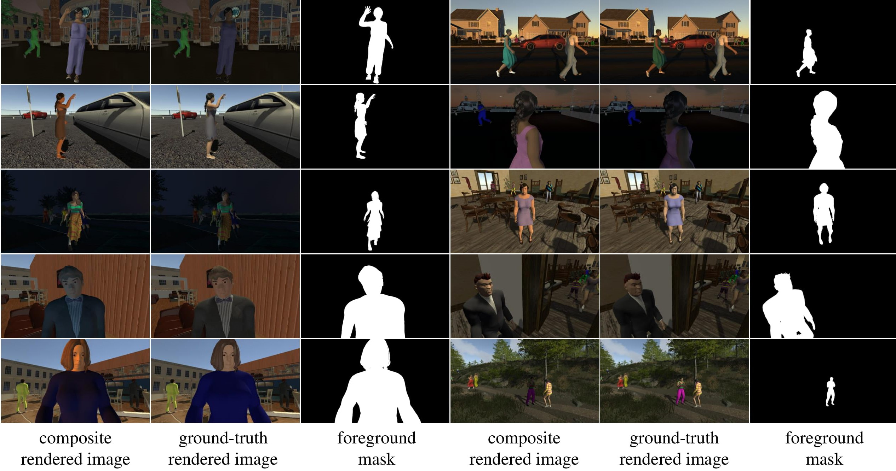
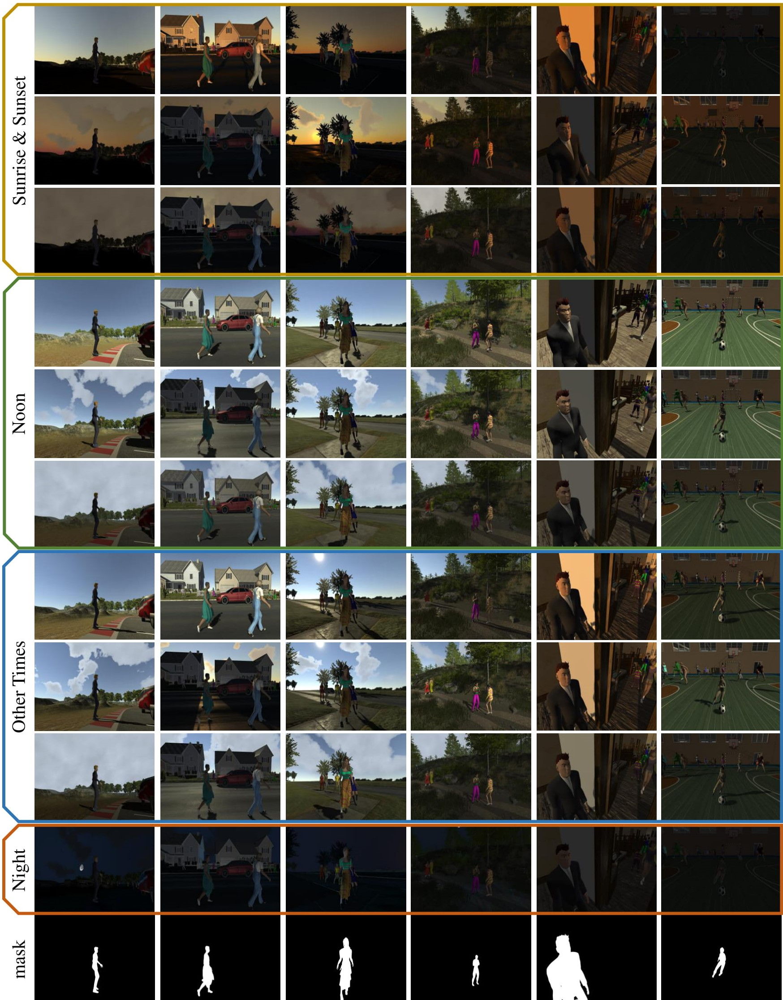
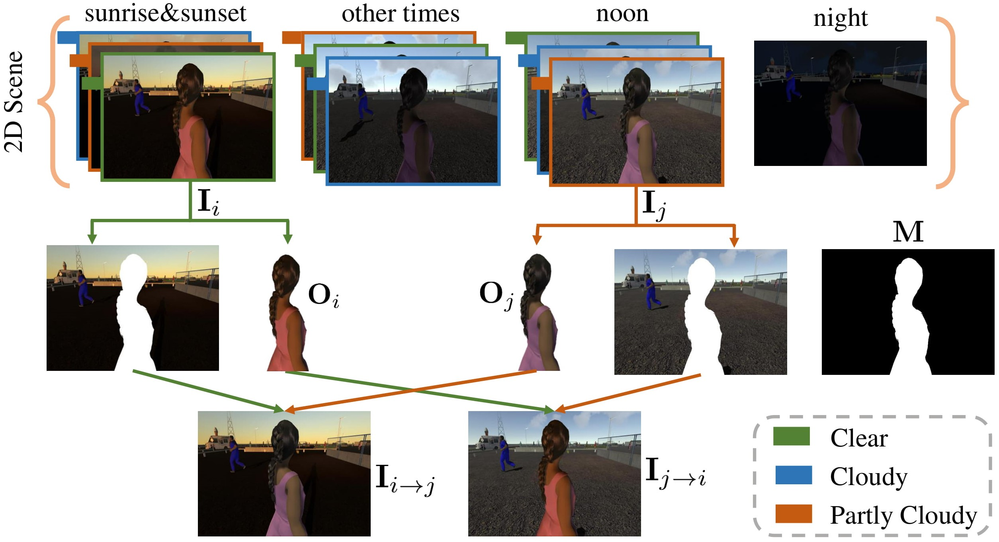

# Rendered_Image_Harmonization_Dataset
[Wenyan Cong](https://wenyancong.com/), Junyan Cao, [Li Niu](http://bcmi.sjtu.edu.cn/home/niuli/), Jianfu Zhang

Welcome to the official homepage of the rendered image harmonization dataset. **RHHarmony** is a large-scale Rendered Human Harmonization dataset containing pairs of ground-truth rendered images and composite rendered images, which is useful for supervised image harmonization methods.

## Highlights

+ 15000 ground-truth rendered images with image resolution of 1920*1080

+ maximally 135000 pairs of ground-truth rendered images and composite rendered images

+ accurate foreground masks

+ automatic rendered image generation and composite image generation

+ 30 indoor/outdoor 3D scenes

+ 50 viewpoints(2D scene) for each 3D scene

+ 10 representative capture conditions for each 2D scene

  

## Research Paper
[Deep Image Harmonization by Bridging the Reality Gap](https://arxiv.org/pdf/2103.17104.pdf)

Wenyan Cong, Junyan Cao, Li Niu, Jianfu Zhang, Xuesong Gao, Zhiwei Tang, Liqing Zhang

## Downloads

+ 15000 ground-truth rendered images [[Baidu_Cloud]]() (access code: ) [[Alternative_address]]()
+ 65000 rendered image pairs used in our paper [[Baidu_Cloud]]() (access code: ) [[Alternative_address]]()

## Details

+ ### **Ground-truth Rendered Image Generation**

  We collect 30 3D scenes from Unity Asset Store and CG websites, including outdoor scenes (e.g., raceway, downtown, street, forest) and indoor scenes (e.g., bar, stadium, gym). For each 2D scene shot in 3D scenes, we sample 10 ground-truth rendered images with 10 different capture conditions (i.e., styles), including the the night style as well as styles of Clear/PartlyCloudy/Cloudy weather at sunrise&sunset/noon/other-times. Example scenes with all 10 ground-truth rendered images are shown below. The left four columns are outdoor scenes (raceway, downtown, street, and forest) and the right two columns are indoor scenes (bar and stadium). Under each time of the day except “Night”, from top to bottom, we show rendered images captured under Clear, Partly Cloudy, and Cloudy weather.

+ ### **Composite Rendered Image Generation**
  
   For each 2D scene, there are 10 ground-truth rendered images with 10 different styles, where one person is treated as the foreground and its foreground mask could be obtained effortlessly using Unity3D. We could generate pairs of ground-truth rendered images and composite rendered images by randomly selecting two different images and exchanging their foregrounds. The illustration of composite rendered image generation process is shown below.

